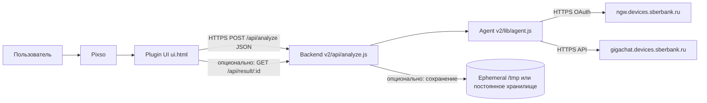

# Design Inspector — Pixso Plugin + LLM‑сервер (документация для ИТ)

Этот документ описывает **как устроен инструмент**, **какая архитектура и требования** нужны для работы, и **что важно учесть при развёртывании/адаптации** под корпоративные политики.

---

## 1) Принцип работы (подробно)

### Назначение
Инструмент состоит из двух частей:
- **Плагин Pixso** (локальный код в репозитории: `manifest.json`, `sandbox.js`, `ui.html`) — собирает структуру макета в JSON и показывает результат пользователю.
- **Сервер** (каталог `v2/`) — принимает JSON, передаёт его в **LLM‑агент**, агент формирует запрос к **GigaChat**, получает текстовый ответ и возвращает его клиенту.

Ключевой принцип безопасности: **секреты GigaChat хранятся только на сервере** (переменные окружения/secret store). Плагин **не содержит** client id/secret.

### Поток данных (end‑to‑end)
1. Пользователь в Pixso запускает плагин.
2. Плагин в `sandbox.js` обходит выбранные ноды (или верхнеуровневые фреймы страницы) и сериализует их в JSON.
3. `ui.html` отправляет JSON на сервер:
   - `POST /api/analyze`
   - `Content-Type: application/json`
   - тело запроса — **сырой JSON‑текст** (строка), как сформировал плагин.
4. Сервер (`v2/api/analyze.js`):
   - валидирует, что тело — корректный JSON;
   - вызывает `v2/lib/agent.js` → функция `ask(jsonString)`;
   - сохраняет запись результата (в текущей реализации — в `/tmp`, см. ограничения ниже);
   - возвращает клиенту JSON, где есть:
     - `agentResponse` — **готовый текст** для пользователя;
     - `resultUrl` — ссылка для ручной проверки сохранённого результата (опционально).
5. `ui.html` показывает `agentResponse` пользователю.

### Что означает “агент сейчас простой, потом заменим”
`v2/lib/agent.js` — это **точка расширения**: сюда добавляют:
- другие модели/endpoint’ы,
- многошаговые сценарии,
- RAG/инструменты,
- строгую валидацию входного JSON,
- форматирование ответа под регламенты организации.

С точки зрения плагина контракт простой: **на вход строка JSON**, **на выход строка текста**.

---

## 2) Архитектура и требования для работы

### Компоненты и границы ответственности
- **Pixso / браузерный UI плагина** (`ui.html`):
  - только пользовательский интерфейс и `fetch` наружу на ваш сервер;
  - не хранит секреты GigaChat.
- **Backend API** (`v2/api/*`):
  - принимает JSON;
  - orchestration: логирование, лимиты, авторизация (если добавите), хранение результата;
  - вызывает агент.
- **LLM‑агент** (`v2/lib/agent.js`):
  - инкапсулирует вызовы к GigaChat;
  - место для будущей “замены агента”.

### Сетевая схема

### Минимальные требования к среде исполнения сервера
- **Node.js 18+** (на Vercel это обычно выполняется автоматически).
- **Исходящий HTTPS** с сервера до:
  - `https://ngw.devices.sberbank.ru:9443/api/v2/oauth`
  - `https://gigachat.devices.sberbank.ru/api/v1/chat/completions`
- **DNS** должен резолвить эти имена (или быть настроен корпоративный DNS/прокси‑маршрут).
- **Секреты** должны быть доступны процессу как переменные окружения:
  - `GIGACHAT_CLIENT_ID`
  - `GIGACHAT_CLIENT_SECRET`

### TLS / корпоративный контур (критично)
В корпоративных сетях часто встречается:
- TLS‑инспекция (MITM) на исходящем трафике,
- корпоративный CA, который **не доверен** “из коробки” Node.js.

Типовой симптом: ошибки TLS вида **`self-signed certificate in certificate chain`**.

Политика для продакшена:
- **нельзя** оставлять отключение проверки TLS как постоянное решение;
- нужно обеспечить **доверие к корпоративному CA** на стороне runtime (или убрать MITM для конкретного маршрута согласованно с ИБ).

Для диагностики (временно) в коде предусмотрен флаг:
- `GIGACHAT_INSECURE_TLS=true`  
Он отключает проверку TLS и полезен только чтобы подтвердить диагноз.

### CORS
Плагин работает в iframe и может иметь “необычный” origin. В `v2/vercel.json` включён `Access-Control-Allow-Origin: *` для `/api/*`.

Для корпоративного контура обычно ужесточают:
- ограничение origin,
- добавление заголовков авторизации (например API‑key),
- WAF/Rate limit на edge.

### Хранение результата (важно для ИТ)
Текущая реализация может сохранять отладочную запись в `/tmp` на serverless.

Ограничения:
- `/tmp` **эфемерный** (может исчезнуть при cold start),
- не подходит как “источник правды”.

Для организации обычно требуется:
- Object Storage / DB / корпоративный журнал,
- политика retention,
- маскирование/запрет сохранения полного JSON (если это персональные/чувствительные данные).

### Производительность и лимиты
- JSON может быть **очень большим** (даже “одна нода” может быть огромным фреймом с деревом детей).
- Нужны лимиты:
  - на размер тела запроса (reverse proxy / API gateway),
  - на время выполнения функции (Vercel `maxDuration` в `vercel.json`),
  - на длину промпта/токены (в `agent.js`).

---

## 3) Полезная информация для ИТ: развёртывание и адаптация под требования организации

### Развёртывание на Vercel (минимальный чек‑лист)
- **Root Directory**: `v2` (иначе не подхватятся `vercel.json` и `api/*`).
- **Environment Variables** (Project, не “глобально случайно”):
  - `GIGACHAT_CLIENT_ID`
  - `GIGACHAT_CLIENT_SECRET`
- После изменения переменных: **Redeploy**.

### Контракт API (для интеграций/тестов)
- `POST /api/analyze`
  - body: JSON‑строка (сырой JSON)
  - response: JSON с `agentResponse` и `resultUrl` (если включено сохранение)
- `GET /api/result/:id`
  - возвращает JSON или HTML (если `Accept` содержит `text/html`)

### Где менять “поведение LLM”
- **`v2/lib/agent.js`**: промпт, модель, параметры `temperature/max_tokens`, усечение входного JSON, ретраи, таймауты, логирование.
- **`v2/api/analyze.js`**: политика хранения (`inputJson` в логах), лимиты, аутентификация, маскирование, корреляционные id.

### Типовые корпоративные доработки (ожидаемые)
- **Аутентификация** вызова `/api/analyze` (API‑key/JWT/mTLS) + согласование CORS.
- **PII/Compliance**: не сохранять полный JSON, redact текста, отдельный audit trail.
- **Наблюдаемость**: структурные логи, трассировка, алерты по 5xx/latency.
- **Надёжность**: очередь задач (если анализ долгий), idempotency key, DLQ.
- **Корпоративный GigaChat**: отдельные endpoint’ы/scope/модель — всё это меняется в `agent.js`.

### Минимальный список вопросов к ИБ/сетевым инженерам
- Нужен ли **явный прокси** для исходящего HTTPS?
- Есть ли **TLS inspection** и какой **CA bundle** официально выдан для доверия приложениям?
- Разрешены ли исходящие соединения к `*.sberbank.ru` с выбранной площадки хостинга?
- Какие требования к **хранению** артефактов анализа (срок, шифрование, география)?

### Репозиторий (ориентир)
Исходный репозиторий проекта: `https://github.com/Largriz/pixso-design-inspector`
